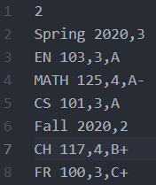

This program makes use of **vectors** in order to
form an array of semesters which   in turn also stores an array of courses for that semester.
  
 You can add as many semesters as you want and the program will calculate your **GPA**. 
  
 You may also save the existing list of semesters to a CSV file. 
 You can later load from your save files and avoid starting from scratch.
 
 
An example of execution:
 
 

 
 
If we had a save file such as:

 

 
 
Then we could load it and we would get:
 
 

